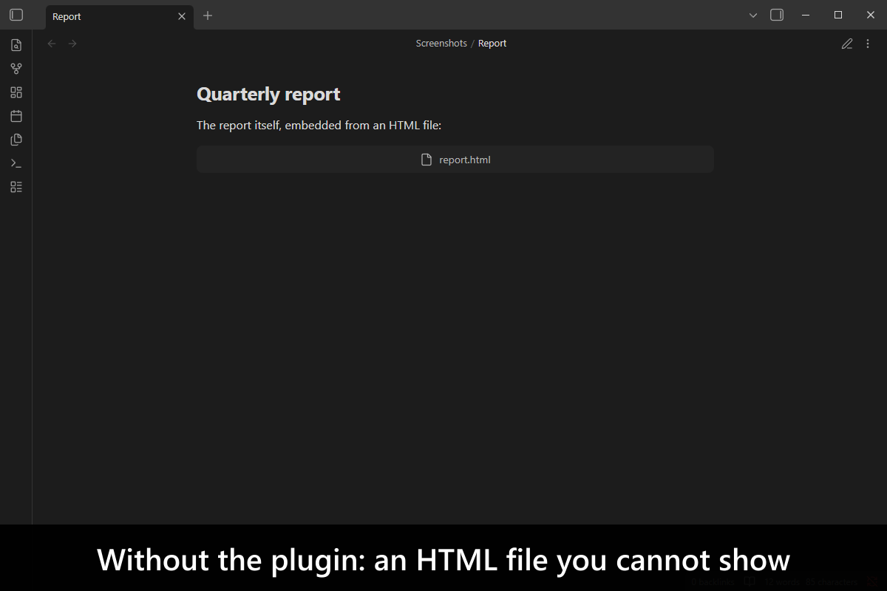
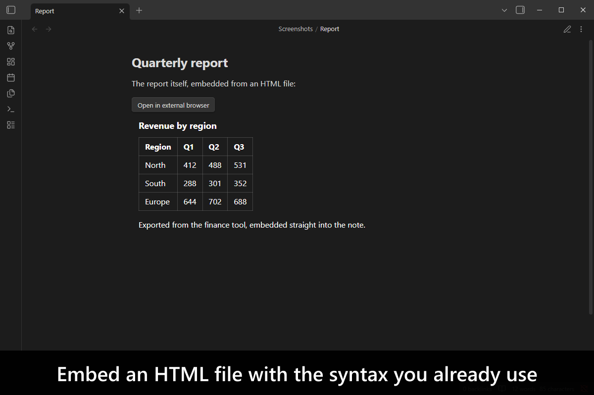
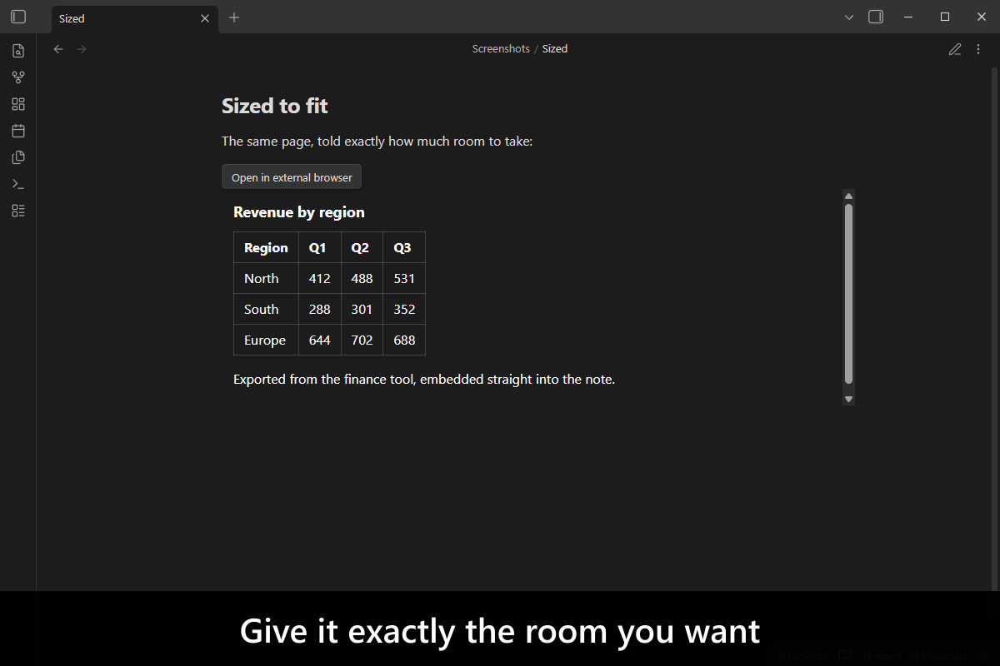
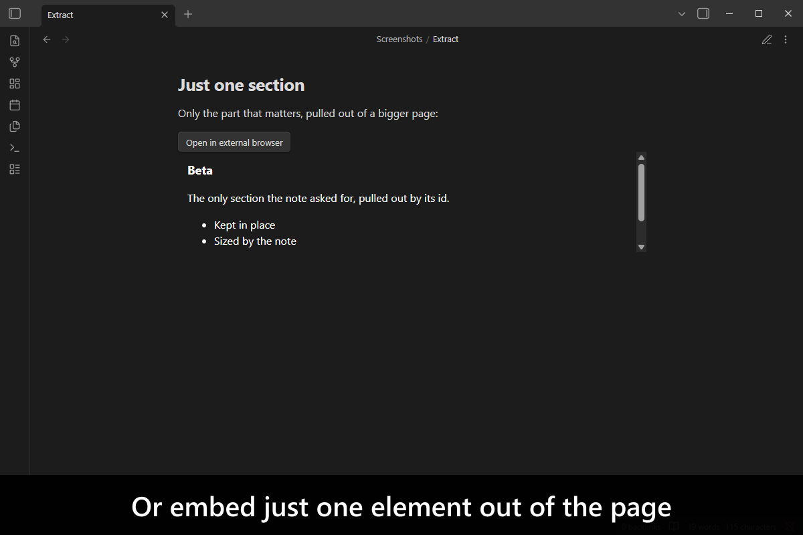
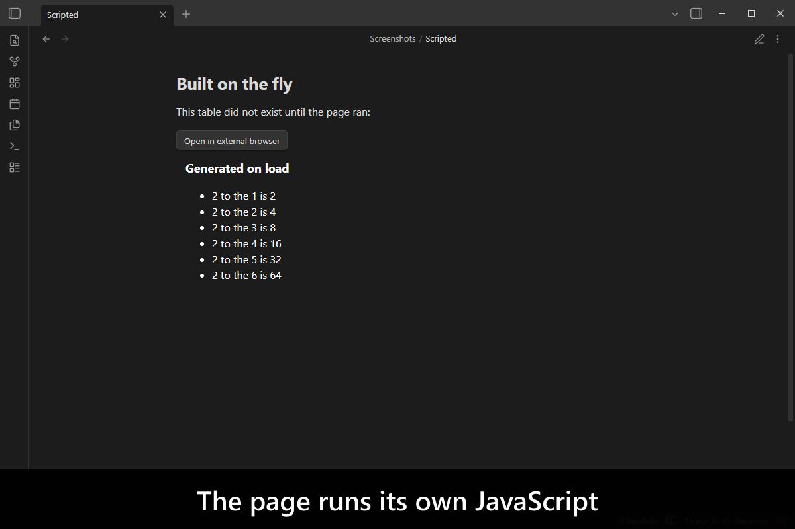
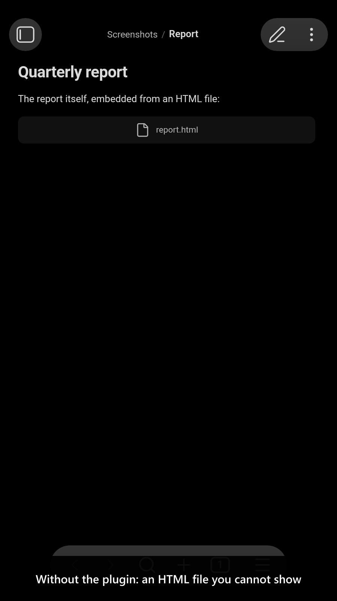
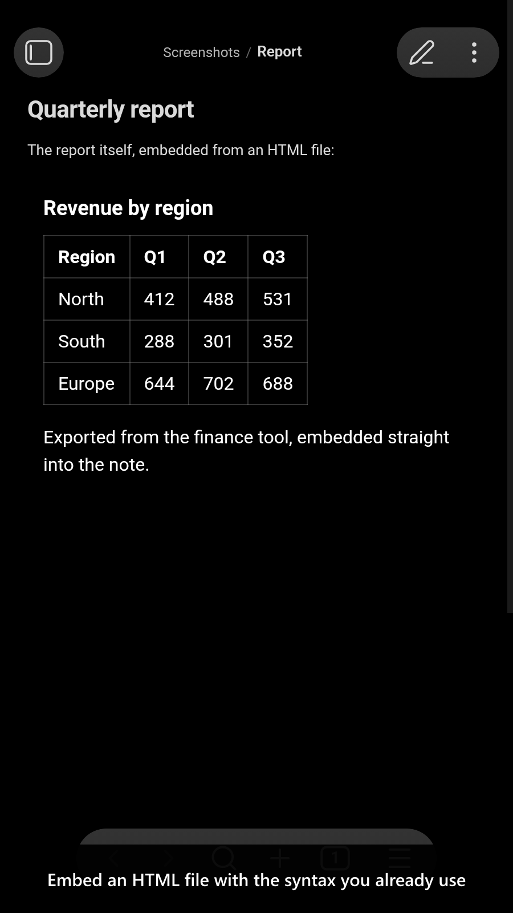
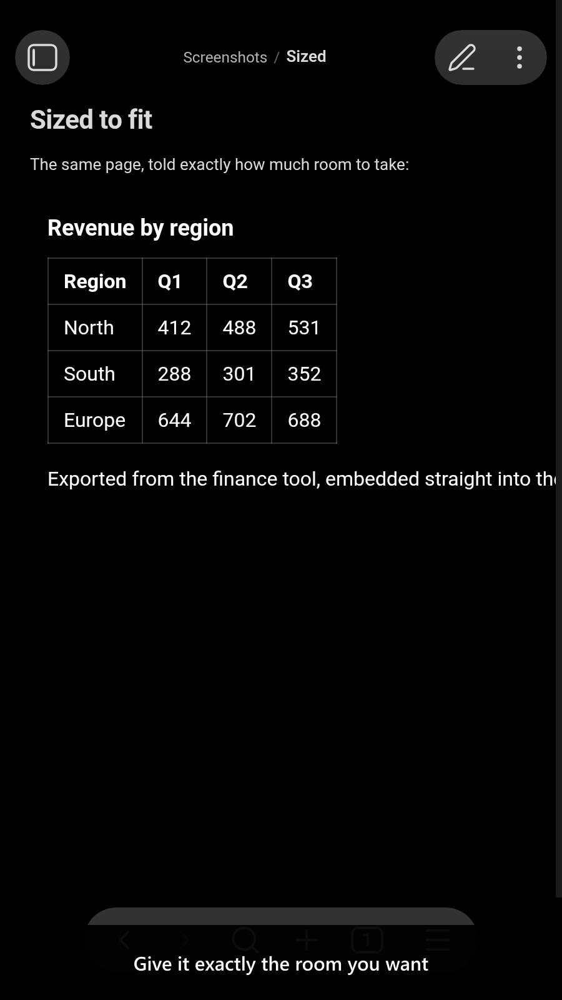
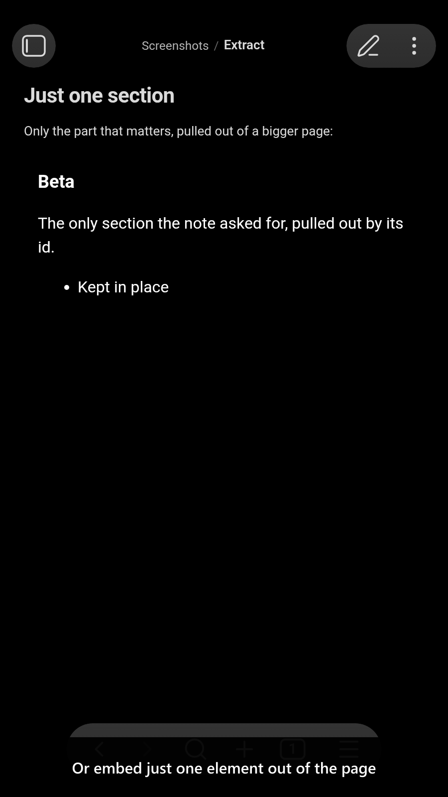
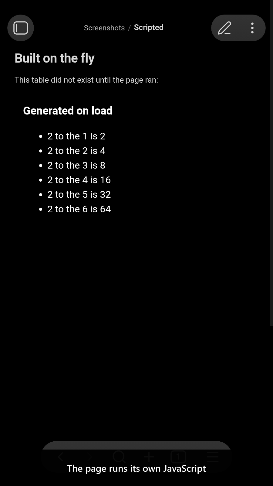

# Embed HTML

[](https://www.buymeacoffee.com/mnaoumov)
[](https://github.com/mnaoumov/obsidian-embed-html/releases)
[](https://github.com/mnaoumov/obsidian-embed-html/releases)
[](https://github.com/mnaoumov/obsidian-embed-html)

[Obsidian](https://obsidian.md/) embeds notes, images and PDFs, but an `.html` file in your vault is
just a file you can open — you cannot show it inside a note. So a report, a chart exported from another
tool, or a page you built yourself has to live outside your notes, or be flattened into a screenshot.

This plugin embeds HTML files directly in a note, with the same `![[file.html]]` syntax you already use,
sized how you want, styled to match your theme, and able to run its own JavaScript.

<!-- markdownlint-disable MD033 -->

<a href="images/screenshots/screenshot-desktop-1.png"></a>

<details>
<summary>More screenshots</summary>

<a href="images/screenshots/screenshot-desktop-2.png"></a>
<a href="images/screenshots/screenshot-desktop-3.png"></a>
<a href="images/screenshots/screenshot-desktop-4.png"></a>
<a href="images/screenshots/screenshot-desktop-5.png"></a>
<a href="images/screenshots/screenshot-mobile-1.png"></a>
<a href="images/screenshots/screenshot-mobile-2.png"></a>
<a href="images/screenshots/screenshot-mobile-3.png"></a>
<a href="images/screenshots/screenshot-mobile-4.png"></a>
<a href="images/screenshots/screenshot-mobile-5.png"></a>

</details>

<!-- markdownlint-enable MD033 -->

## Demo vault

**The documentation is an interactive demo vault.** Every feature has a note that explains what it does
and why you would want it, with real HTML files already in place to embed.

**[Start reading here](<./demo-vault/00 Start.md>)** — it is plain markdown, so it works on GitHub with
nothing installed.

A copy of the vault ships with every release. You can access it via any of the following:

1. Running the **Embed HTML: Open demo vault** command.
2. Downloading `embed-html-demo-vault-<version>.zip` (`<version>` is the release version) from the [Releases](https://github.com/mnaoumov/obsidian-embed-html/releases).
3. Browsing its source in [`demo-vault/`](./demo-vault/README.md) in this repository.

## What it does

- **Embed an HTML file in a note**, with `htm`, `html`, `shtml`, `xht` and `xhtml` all supported.
  [01 Basic Embed](<./demo-vault/01 Basic Embed.md>) ·
  [07 File Extensions](<./demo-vault/07 File Extensions.md>)
- **Size it** — a width, a height, both, auto-fit to the content, or full control with CSS
  declarations, with defaults in the settings.
  [02 Custom Size](<./demo-vault/02 Custom Size.md>)
- **Show only part of a page** — scroll to an element by id, or extract just that element.
  [03 Scroll to Element](<./demo-vault/03 Scroll to Element.md>) ·
  [04 Extract Element](<./demo-vault/04 Extract Element.md>)
- **It stays a real page** — its JavaScript runs, its links work, and its stylesheets, scripts, images
  and fonts load.
  [05 JavaScript](<./demo-vault/05 JavaScript.md>) ·
  [06 Links](<./demo-vault/06 Links.md>) ·
  [13 External Stylesheets and Assets](<./demo-vault/13 External Stylesheets and Assets.md>)
- **It fits your vault** — follows your theme's color scheme, takes a border and background, and can
  open in its own tab or in your external browser.
  [09 Appearance](<./demo-vault/09 Appearance.md>) ·
  [08 Direct View](<./demo-vault/08 Direct View.md>) ·
  [11 Open in External Browser](<./demo-vault/11 Open in External Browser.md>)
- **Paths work how you expect** — relative to the note or from the vault root.
  [10 Relative and Full Path](<./demo-vault/10 Relative and Full Path.md>)
- **Table headers stay put** while you scroll a long table.
  [12 Sticky Table Headers](<./demo-vault/12 Sticky Table Headers.md>)

## Installation

The plugin is available in [the official Community Plugins repository](https://community.obsidian.md/plugins/embed-html).

### Beta versions

To install the latest beta release of this plugin (regardless if it is available in [the official Community Plugins repository](https://community.obsidian.md) or not), follow these steps:

1. Ensure you have the [BRAT plugin](https://community.obsidian.md/plugins/obsidian42-brat) installed and enabled.
2. Click [Install via BRAT](https://intradeus.github.io/http-protocol-redirector?r=obsidian://brat?plugin=https://github.com/mnaoumov/obsidian-embed-html).
3. An Obsidian pop-up window should appear. In the window, click the `Add plugin` button once and wait a few seconds for the plugin to install.

## Debugging

By default, debug messages for this plugin are hidden.

To show them, run the following command in the `DevTools Console`:

```js
window.DEBUG.enable('embed-html');
```

For more details, refer to the [documentation](https://mnaoumov.dev/obsidian-dev-utils/guides/debugging/).

## Changelog

All notable changes to this project will be documented in the [CHANGELOG](./CHANGELOG.md).

## Contributing

Contributions are welcome — see [CONTRIBUTING](./CONTRIBUTING.md) to get set up.

## Support

<!-- markdownlint-disable MD033 -->

<a href="https://www.buymeacoffee.com/mnaoumov" target="_blank"></a>

<!-- markdownlint-enable MD033 -->

## My other Obsidian resources

[See my other Obsidian resources](https://github.com/mnaoumov/obsidian-resources).

## License

© [Michael Naumov](https://github.com/mnaoumov/)
